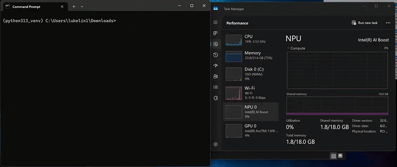

# About this repo
This repo is used to document our testing steps for LiteRT (formerly TensorFlow Lite) and LiteRT-LM with the OpenVINO backend.



# Quick Steps
## Installation
Install and upgrade `litert-lm` to the latest version.
```
pip install --upgrade litert-lm
```
Install and upgrade `openvino` to the latest version.
```
pip install --upgrade openvino
```
Log file [installation.log](./log/installation.log) is provided for reference.

## Example - Chat
Run below commands to download Gemma4 and run the model
### Run on CPU
```
litert-lm run ^
--from-huggingface-repo=litert-community/gemma-4-E2B-it-litert-lm gemma-4-E2B-it.litertlm ^
--backend=cpu ^
--prompt="What is OpenVINO?"
```
### Run on GPU
```
litert-lm run ^
--from-huggingface-repo=litert-community/gemma-4-E2B-it-litert-lm gemma-4-E2B-it.litertlm ^
--backend=gpu ^
--enable-speculative-decoding=true ^
--prompt="What is OpenVINO?"
```
* Use the `--enable-speculative-decoding=true` flag is recommended for GPU backend. [(source)](https://ai.google.dev/edge/litert-lm/cli#mtp)
### Run on NPU (Lunar Lake)
```
litert-lm run ^
--from-huggingface-repo=litert-community/gemma-4-E2B-it-litert-lm gemma-4-E2B-it_intel_LNL.litertlm ^
--backend=npu ^
--prompt="What is OpenVINO?"
```
* Please note the model name changes to `gemma-4-E2B-it_intel_LNL.litertlm`
### Run on NPU (Panther Lake)
```
litert-lm run ^
--from-huggingface-repo=litert-community/gemma-4-E2B-it-litert-lm gemma-4-E2B-it_intel_PTL.litertlm ^
--backend=npu ^
--prompt="What is OpenVINO?"
```
* Please note the model name changes to `gemma-4-E2B-it_intel_PTL.litertlm`
### Note
* There is no need to worry about models being re-downloaded, as they will be cached under `%USERPROFILE%\.cache\huggingface\hub\` after they are downloaded once
* You may also manually download the models in advance from [HuggingFace](https://huggingface.co/litert-community/gemma-4-E2B-it-litert-lm/tree/main)
### Sample log
```
(python313_venv) C:\Users\lukelin1\Downloads>litert-lm run ^
--from-huggingface-repo=litert-community/gemma-4-E2B-it-litert-lm gemma-4-E2B-it_intel_LNL.litertlm ^
--backend=npu ^
--prompt="What is the capital of France?"

Downloading gemma-4-E2B-it_intel_LNL.litertlm from litert-community/gemma-4-E2B-it-litert-lm...
The capital of France is **Paris**.
```
Log file [chat.log](./log/chat.log) is provided for reference.

## Example - Audio Transcription and Translation
```
litert-lm run ^
--from-huggingface-repo=litert-community/gemma-4-E2B-it-litert-lm gemma-4-E2B-it.litertlm ^
--backend=gpu ^
--enable-speculative-decoding=true ^
--prompt="transcribe the audio then translate it to Chinese" ^
--attachment "./sample/how_are_you_doing_today.wav" ^
--audio-backend=cpu
```
* Audio sample [```how_are_you_doing_today.wav```](./sample/how_are_you_doing_today.wav) is attached ([source](https://storage.openvinotoolkit.org/models_contrib/speech/2021.2/librispeech_s5/how_are_you_doing_today.wav))
* Supported backends are `cpu` and `gpu`
* Supported audio-backend is `cpu`
### Sample log
```
(python313_venv) C:\GitHub\openvino-litert-test>litert-lm run ^
--from-huggingface-repo=litert-community/gemma-4-E2B-it-litert-lm gemma-4-E2B-it.litertlm ^
--backend=gpu ^
--enable-speculative-decoding=true ^
--prompt="transcribe the audio then translate it to Chinese" ^
--attachment "./sample/how_are_you_doing_today.wav" ^
--audio-backend=cpu

Downloading gemma-4-E2B-it.litertlm from litert-community/gemma-4-E2B-it-litert-lm...
How are you doing today?
今天你怎么样？
```
Log file [transcribe_translate_audio.log](./log/transcribe_translate_audio.log) is provided for reference.

## Example - Image Description and Translation
```
litert-lm run ^
--from-huggingface-repo=litert-community/gemma-4-E2B-it-litert-lm gemma-4-E2B-it.litertlm ^
--backend=gpu ^
--enable-speculative-decoding=true ^
--prompt="describe and translate the picture" ^
--attachment "./sample/image_cs.jpg" ^
--vision-backend=gpu
```
* Image sample [```image_cs.jpg```](./sample/image_cs.jpg) is attached. It contains a traffic sign written in Czech characters ([`source`](https://c7.alamy.com/comp/2YAX36N/traffic-signs-in-czech-republic-pedestrian-zone-2YAX36N.jpg))
* Supported backends are `cpu` and `gpu`
* Supported vision-backends are `cpu` and `gpu`
### Sample log
**Input**

**Output**
```
Here is the translation of the text from Czech into English:

*   **PĚŠÍ ZÓNA:** Pedestrian Zone (or Pedestrian Area)
*   **ZÁSOBOVÁNÍ:** (This word is slightly less common in this context, but it relates to "supply" or "provision." In the context of a pedestrian zone, it might be part of a specific local regulation, but the main meaning is "Pedestrian Zone.")
*   **IZS, CBS V ZÁSAHU:** This is likely an abbreviation or specific local reference. Without further context, it's hard to translate precisely, but it points to specific authorities or regulations ("IZS, CBS" might be acronyms for local departments or rules).
*   **0 - 24 h:** 0 - 24 hours (indicating the zone is active 24/7)
```
Log file [describe_translate_image.log](./log/describe_translate_image.log) is provided for reference.

## Example - Function Calling / Tools
You can run tools with presets. [(link)](https://ai.google.dev/edge/litert-lm/cli#function_calling_tools)

Here we create a [preset.py](./tool/preset.py) that can get stock price and get current time.

Install required package
```
pip install yfinance
```
Run below command
```
litert-lm run ^
--from-huggingface-repo=litert-community/gemma-4-E2B-it-litert-lm gemma-4-E2B-it.litertlm ^
--backend=gpu ^
--enable-speculative-decoding=true ^
--preset="./tool/preset.py"
```
### Sample log
```
(python313_venv) C:\GitHub\openvino-litert-test>litert-lm run ^
More? --from-huggingface-repo=litert-community/gemma-4-E2B-it-litert-lm gemma-4-E2B-it.litertlm ^
More? --backend=gpu ^
More? --enable-speculative-decoding=true ^
More? --preset="./tool/preset.py"
Downloading gemma-4-E2B-it.litertlm from litert-community/gemma-4-E2B-it-litert-lm...
Loading preset from ./tool/preset.py:
- System instruction: You are a helpful assistant with access to tools.
- Tools:
  - get_current_time
  - get_stock_price
[enter] submit | [ctrl+j] newline | [ctrl+c] clear/exit

> What time is it?
[tool_call] {"name": "get_current_time", "arguments": {}}
[tool_response] "2026-05-25 13:24:49"
It is currently 1:24 PM on May 25, 2026.
> What is Intel's stock price?
[tool_call] {"name": "get_stock_price", "arguments": {"symbol": "INTC"}}
[tool_response] "Symbol: INTC\nPrice: 119.84 USD\nChange: +0.49 (+0.41%)\nPrevious Close: 119.35 USD"
The current stock price for Intel (INTC) is $119.84 USD, which is a change of +0.49 (+0.41%) from the previous close of $119.35 USD.
>
```
Log file [function_calling.log](./log/function_calling.log) is provided for reference.

# Reference
* [OpenVINO™ backend for LiteRT: Optimize NPU performance on Intel® Core™ Ultra processors](https://www.intel.com/content/www/us/en/developer/articles/community/litert-unlocks-core-ultra-npu-performance-for-aipc.html)
* [LiteRT-LM CLI](https://ai.google.dev/edge/litert-lm/cli)


# Future Works
* Try classical models using LiteRT on Intel NPU, for both JIT and AOT model
<br>https://ai.google.dev/edge/litert/next/intel</br>
