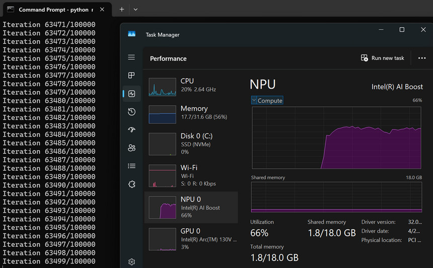

# About this folder
This folder is used to document our testing steps for running classical (vision, audio, and NLP) models with LiteRT (formerly TensorFlow Lite) OpenVINO backend on Intel NPUs.

The model can be executed in the following two modes
* **Just-in-time (JIT)** — Load a raw .tflite, no need to compile model in advance; the compiler plugin partitions and compiles supported ops for the NPU at CompiledModel.from_file() time. Adds some first-run latency (varies by model).
* **Ahead-of-time (AOT)** — Load a compiled .tflite, so compile model in advance is required. Therefore the partition and compilation step at load time can be skipped.

# Steps

### This example comes from [ImageNet LiteRT end-to-end sample](https://github.com/google-ai-edge/litert-samples/tree/main/end_to_end/imagenet). We leverage it to run MobileNet_v2 with LiteRT on Intel NPU

## Export model (Linux only)
The exported models [`mobilenet_v2.tflite`](./mobilenet_v2.tflite) and quantized [`mobilenet_v2.int8.tflite`](./mobilenet_v2.int8.tflite) have been included in the repo.

You may also export models on your own. Model export is only supported on Linux as the required [litert-torch](https://github.com/google-ai-edge/litert-torch) package is only available on Linux

Run below commands to generate `mobilenet_v2.tflite` and quantized `mobilenet_v2.int8.tflite`
```
pip install uv
uv run main.py convert --arch mobilenet_v2
uv run main.py convert --arch mobilenet_v2 --output mobilenet_v2.int8.tflite --quantize
```
Log file [export.log](./log/export.log) is provided for reference.

## Run model
### Prepare a test image
The test image [coco.jpg](./coco.jpg) has been included in the repo. You may also download it on your own.
```
curl -o coco.jpg https://storage.openvinotoolkit.org/repositories/openvino_notebooks/data/data/image/coco.jpg
```
### Prepare label files
The script requires ImageNet label metadata to map model outputs to human-readable names.
The lable files [imagenet_lsvrc_2015_synsets.txt](./imagenet_lsvrc_2015_synsets.txt) and [imagenet_metadata.txt](./imagenet_metadata.txt) have been included in the repo. You may also download them on your own.

```
curl -sSL -o imagenet_lsvrc_2015_synsets.txt https://raw.githubusercontent.com/tensorflow/models/refs/heads/master/research/slim/datasets/imagenet_lsvrc_2015_synsets.txt

curl -sSL -o imagenet_metadata.txt https://raw.githubusercontent.com/tensorflow/models/refs/heads/master/research/slim/datasets/imagenet_metadata.txt
```
### Install required packages

Install OpenVINO's `ai-edge-litert` and `ai-edge-litert-sdk`

Reference: https://ai.google.dev/edge/litert/next/intel

```
pip install --pre --extra-index-url https://storage.openvinotoolkit.org/simple/wheels/nightly ai-edge-litert-nightly ai-edge-litert-sdk-intel-nightly
```
Install other required packages
```
pip install -r requirements.txt
```
Run below command to verify installation
```
python check.py
```
* The content of `check.py` is copied from [here](https://ai.google.dev/edge/litert/next/intel#4-verify-installation)

Expected output
```
Backend: intel_openvino
Dispatch: C:\Python\python313_venv\Lib\site-packages\ai_edge_litert\vendors\intel_openvino\dispatch
OpenVINO: 2026.2.0-21820-9a25caa5a15
SDK libs: ['openvino_intel_npu_compiler.dll', 'openvino_intel_npu_compiler_loader.dll']
Available devices: ['CPU', 'GPU', 'NPU']
```
Log file [install.log](./log/install.log) is provided for reference.

### Run, Just-in-time (JIT) Mode
Input below command
```
python main.py --model mobilenet_v2.tflite --image coco.jpg
```
* This [`main.py`](./main.py) is modified from the original [main.py](https://github.com/google-ai-edge/litert-samples/blob/main/end_to_end/imagenet/main.py). You may compare them to check the differences
* You can also test the quantized `mobilenet_v2.int8.tflite` model

**Input**
<p></p>

**Expected Result**
```
1: n02099267 flat-coated retriever (0.443499)
2: n02099712 Labrador retriever (0.324956)
3: n02093256 Staffordshire bullterrier, Staffordshire bull terrier (0.079632)
4: n02109047 Great Dane (0.044876)
5: n02111277 Newfoundland, Newfoundland dog (0.027100)
```
Log file [run_jit.log](./log/run_jit.log) is provided for reference.
### Run, Ahead-of-time (AOT) Mode
#### Compile the model in advance
Compile the model for Lunar Lake (LNL)
```
python aot_compile.py --model mobilenet_v2.tflite --soc_model LNL
```
Compile the model for Panther Lake (PTL)
```
python aot_compile.py --model mobilenet_v2.tflite --soc_model PTL
```
Compile the model for every registered backend/target
```
python aot_compile.py --model mobilenet_v2.tflite
```
Log file [aot_compile.log](./log/aot_compile.log) is provided for reference.
#### Run the compiled model
On LNL
```
python main.py --model mobilenet_v2_IntelOpenVINO_LNL_apply_plugin.tflite --image coco.jpg
```
On PTL
```
python main.py --model mobilenet_v2_IntelOpenVINO_LNL_apply_plugin.tflite --image coco.jpg
```
Log file [run_aot.log](./log/run_aot.log) is provided for reference.

### Get Noticeable NPU loading
Since the workload is too small to see NPU loading in the task manager. You can keep running the inference using a loop to have a noticeable NPU usage.
``` python
# model.run_by_index(signature_index, input_buffers, output_buffers)
  loop_count = 100000
  for i in range(loop_count):
    print(f"Iteration {i + 1}/{loop_count}")
    model.run_by_index(signature_index, input_buffers, output_buffers)
```
<p></p>

### Know issues
You may see below WARNING from the log. This message is actually a misleading warning generated by the LiteRT framework. It is initiated by an internal Environment creation within the LiteRT CompiledModel, and is not relevant to the original Environment created by the user.
```
WARNING: [litert/runtime/accelerators/npu_registry.cc:34] NPU accelerator could not be loaded and registered: kLiteRtStatusErrorInvalidArgument.
```
# Reference
* [OpenVINO™ backend for LiteRT: Optimize NPU performance on Intel® Core™ Ultra processors](https://www.intel.com/content/www/us/en/developer/articles/community/litert-unlocks-core-ultra-npu-performance-for-aipc.html)
* [Intel NPU (OpenVino) with LiteRT](https://ai.google.dev/edge/litert/next/intel)
